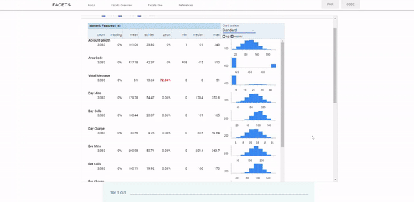

# End-to-End-Machine-Learning-CI-CD-Pipeline-on-AWS

## Continuous Integration and Continous Depoloyment

              

**MLOps or Machine Learning Operations** is a concept that can help you:implement CI/CD applied to machine learning and create an automated infrastructure to support your AI processes.

**With this solution template you can:**
  
1. Create/operate an automated ML pipeline using a a CI/CD tool CodePipeline, to orchestrate the ML workflow.
  
2. Create a Docker container from scratch with your own algorithm.
  
3. Automatically start a training/deployment job by uploading data to S3.
  
4. Run A/B tests and more. 
  

**This also can be implemented a reference architecture that can be used as an inspiration to create your own solution!**

All required components of the pipeline including Lambda functions to automatically run our code are including in the CloudFormation template below.
The template creates the following services and infrastructure:
* Jupyter Notebook
* AWS CodePipeline
* AWS CodeCommit
* AWS CodeBuild
* Amazon ECR
* Amazon SageMaker
* AWS CloudFormation

Just click the launch stack and complete AWS steps to automatically build your infrastructure as code ML Ops pipeline!

Region| Launch
------|-----
US East 1 | 
