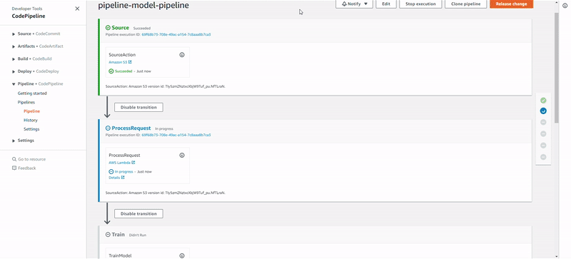

# End-to-End-Machine-Learning-CI-CD-Pipeline-on-AWS

## Continuous Integration and Continous Depoloyment

              

**MLOps or Machine Learning Operations** is a concept that can help you:implement CI/CD applied to machine learning and create an automated infrastructure to support your AI processes.

**With this solution template you can:**
  
1. Create/operate an automated ML pipeline using a a CI/CD tool CodePipeline, to orchestrate the ML workflow.
  
2. Create a Docker container from scratch with your own algorithm.
  
3. Automatically start a training/deployment job by uploading data to S3.
  
4. Run A/B tests and more. 
  

              

**This also can be implemented a reference architecture that can be used as an inspiration to create your own solution!**

All required components of the pipeline including Lambda functions to automatically run our code are including in the CloudFormation template below.
The template creates the following services and infrastructure:
* Jupyter Notebook
* CodePipeline
* CodeCommit
* CodeBuild
* Amazon ECR
* SageMaker
* CloudFormation

Just click the launch stack and complete AWS steps to automatically build your infrastructure as code ML Ops pipeline!

Region| Launch
------|-----
US East 1 | 

This solution can be broken down into the following steps: 

1. An ETL process or the ML Developer, prepares a new dataset for training the model and copies it into an S3 Bucket;
2. CodePipeline listens to this S3 Bucket, calls a Lambda function for start training a job in Sagemaker;
3. The lambda function sends a training job request to Sagemaker;
4. When the training is finished, CodePipeline gets its status goes to the next stage if there is no error;
5. CodePipeline calls CloudFormation to deploy a model in a Development/QA environment into Sagemaker;
6. After finishing the deployment in DEV/QA, CodePipeline awaits for a manual approval
7. An approver approves or rejects the deployment. If rejected the pipeline stops here; If approved it goes to the next stage;
8. CodePipeline calls CloudFormation to deploy a model into production. This time, the endpoint will count with an AutoScaling policy for HA and Elasticity.

### Crisp DM

It is important to mention that the process above is based on industry standard process for Data Mining and Machine Learning called [CRISP-DM](https://en.wikipedia.org/wiki/Cross_Industry_Standard_Process_for_Data_Mining).

CRISP-DM stands for “Cross Industry Standard Process – Data Mining” and is an excellent skeleton to build a data science project around.

       

There are 6 phases to CRISP:
   - **Business understanding**: Don’t dive into the data immediately! First take some time to understand: Business objectives, Surrounding context, ML problem category.
   - **Data understanding**: Exploring the data gives us insights about tha paths we should follow.
   - **Data preparation**: Data cleaning, normalization, feature selection, feature engineering, etc.
   - **Modeling**: Select the algorithms, train your model, optimize it as necessary.
   - **Evaluation**: Test your model with different samples, with real data if possible and decide if the model will fit the requirements of your business case.
   - **Deployment**: Deploy into production, integrate it, do A/B tests, integration tests, etc.

Notice the arrows in the diagram though. CRISP frames data science as a cyclical endeavor - more insights leads to better business understanding, which kicks off the process again.
